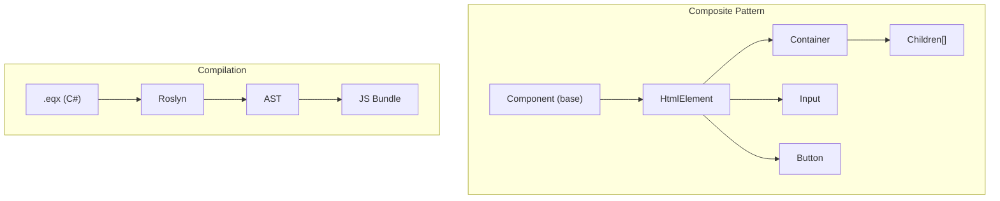
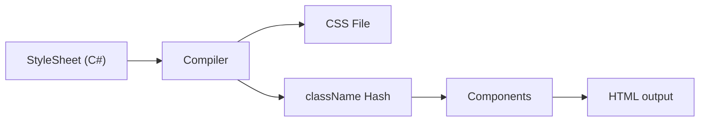

# eQuantic.UI - POC Implementation Plan

> **Component-based UI Framework for .NET Web** - Type-safe, compiler-first, HTML-native

## Executive Summary

eQuantic.UI is a **Flutter-inspired** (not a copy) UI framework for building web applications with C#. It uses the **Composite Pattern** with components that have native HTML element characteristics, compiling C# code to optimized JavaScript.

**Key Differentiators:**

- **Component-based** (not "Widget") - familiar web terminology
- **HTML-native base** - every component has native HTML attributes
- **Composite Pattern** - true tree composition, not just nesting

**Goal**: Counter app with TextBox ↔ Button interaction, hot reload, bundle <30kb

**Timeline**: 6 weeks (January 23 - March 6, 2026)

---

## Architecture Overview



### Core Philosophy

| Principle             | Description                                                      |
| --------------------- | ---------------------------------------------------------------- |
| **Composite Pattern** | Components as tree nodes with children                           |
| **HTML-Native**       | Every element has `id`, `className`, `style`, `data-*`, `aria-*` |
| **CSS-in-C#**         | Type-safe styles, compiled to optimized CSS with hash classNames |
| **Type-Safe**         | Full C# IntelliSense, no runtime type errors                     |
| **Minimal Runtime**   | ~10-15kb, beat Blazor WASM (2MB+)                                |

---

## CSS-in-C# Styling System

### Concept

Define styles as C# objects → Compiler generates optimized CSS with unique classNames → Components reference styles for reuse.



### StyleSheet API

```csharp
// Define reusable styles as C# objects
public static class AppStyles
{
    // Basic style class
    public static readonly StyleClass Button = new()
    {
        BackgroundColor = Colors.Blue[500],
        Color = Colors.White,
        Padding = Spacing.Symmetric(vertical: 8, horizontal: 16),
        BorderRadius = 4,
        FontWeight = FontWeight.Medium,
        Cursor = Cursor.Pointer,

        // Pseudo-classes
        Hover = new()
        {
            BackgroundColor = Colors.Blue[600]
        },

        Active = new()
        {
            BackgroundColor = Colors.Blue[700]
        }
    };

    // Variant styles (composition)
    public static readonly StyleClass ButtonPrimary = Button.Extend(new()
    {
        BackgroundColor = Colors.Primary,
        Hover = new() { BackgroundColor = Colors.PrimaryDark }
    });

    public static readonly StyleClass ButtonSecondary = Button.Extend(new()
    {
        BackgroundColor = Colors.Gray[200],
        Color = Colors.Gray[800]
    });

    // Responsive styles
    public static readonly StyleClass Container = new()
    {
        MaxWidth = 1200,
        Margin = Spacing.Horizontal(auto: true),
        Padding = Spacing.All(16),

        Media = new()
        {
            [Breakpoint.Mobile] = new() { Padding = Spacing.All(8) },
            [Breakpoint.Tablet] = new() { MaxWidth = 768 }
        }
    };
}
```

### Generated Output

```css
/* Generated: app.styles.css */
.eqx-a3f2d1 {
  background-color: #3b82f6;
  color: #ffffff;
  padding: 8px 16px;
  border-radius: 4px;
  font-weight: 500;
  cursor: pointer;
}
.eqx-a3f2d1:hover {
  background-color: #2563eb;
}
.eqx-a3f2d1:active {
  background-color: #1d4ed8;
}

.eqx-b7c4e2 {
  background-color: var(--color-primary);
}
.eqx-b7c4e2:hover {
  background-color: var(--color-primary-dark);
}

@media (max-width: 640px) {
  .eqx-c9d5f3 {
    padding: 8px;
  }
}
```

### Usage in Components

```csharp
// Counter.eqx
public override IComponent Build(RenderContext context)
{
    return new Container
    {
        // Use compiled StyleClass → generates className="eqx-a3f2d1"
        StyleClass = AppStyles.Button,

        // Additional inline styles (merged)
        Style = new() { MarginTop = 16 },

        // Or combine multiple StyleClasses
        StyleClasses = [AppStyles.Button, AppStyles.Shadow],

        Children = { new Text("Click me") }
    };
}
```

### Key Features

| Feature                   | Description                               |
| ------------------------- | ----------------------------------------- |
| **Hash-based classNames** | `eqx-{hash}` prevents conflicts           |
| **Composition**           | `StyleClass.Extend()` for variants        |
| **Pseudo-classes**        | `:hover`, `:active`, `:focus` support     |
| **Responsive**            | `Media` breakpoints                       |
| **CSS Variables**         | `Colors.Primary` → `var(--color-primary)` |
| **Tree-shaking**          | Unused styles removed from bundle         |
| **IntelliSense**          | Full autocomplete for CSS properties      |

## Composite Pattern Architecture

```csharp
// Base interface - Composite Pattern
public interface IComponent
{
    string? Id { get; set; }
    string? ClassName { get; set; }
    HtmlStyle? Style { get; set; }
    Dictionary<string, string>? DataAttributes { get; set; }
    Dictionary<string, string>? AriaAttributes { get; set; }

    IReadOnlyList<IComponent> Children { get; }
    void AddChild(IComponent child);
    void RemoveChild(IComponent child);

    HtmlNode Render();
}

// Abstract base - HTML native characteristics
public abstract class HtmlElement : IComponent
{
    // Native HTML attributes
    public string? Id { get; set; }
    public string? ClassName { get; set; }
    public HtmlStyle? Style { get; set; }
    public string? Title { get; set; }
    public bool? Hidden { get; set; }
    public int? TabIndex { get; set; }

    // Data & ARIA attributes
    public Dictionary<string, string>? DataAttributes { get; set; }
    public Dictionary<string, string>? AriaAttributes { get; set; }

    // Events (native HTML events)
    public Action? OnClick { get; set; }
    public Action? OnFocus { get; set; }
    public Action? OnBlur { get; set; }
    public Action<MouseEventArgs>? OnMouseEnter { get; set; }
    public Action<MouseEventArgs>? OnMouseLeave { get; set; }
    public Action<KeyboardEventArgs>? OnKeyDown { get; set; }
    public Action<KeyboardEventArgs>? OnKeyUp { get; set; }

    // Composite Pattern
    protected List<IComponent> _children = new();
    public IReadOnlyList<IComponent> Children => _children.AsReadOnly();

    public virtual void AddChild(IComponent child) => _children.Add(child);
    public virtual void RemoveChild(IComponent child) => _children.Remove(child);

    public abstract HtmlNode Render();
}
```

---

## Project Structure

```
equantic-ui/
├── src/
│   ├── eQuantic.UI.Core/              # Core abstractions
│   │   ├── IComponent.cs              # Composite interface
│   │   ├── HtmlElement.cs             # HTML-native base
│   │   ├── StatelessComponent.cs      # Stateless components
│   │   ├── StatefulComponent.cs       # Stateful components
│   │   ├── ComponentState.cs          # State management
│   │   ├── RenderContext.cs           # Render tree context
│   │   ├── HtmlNode.cs                # Virtual DOM node
│   │   └── Styling/
│   │       ├── StyleClass.cs          # Reusable style definition
│   │       ├── HtmlStyle.cs           # Inline styles
│   │       ├── Spacing.cs             # margin/padding
│   │       ├── Colors.cs              # Color palette
│   │       └── Breakpoint.cs          # Media query breakpoints
│   │
│   ├── eQuantic.UI.Components/        # Base components
│   │   ├── Container.cs               # <div> wrapper
│   │   ├── Text.cs                    # <span>/<p> text
│   │   ├── Button.cs                  # <button>
│   │   ├── TextInput.cs               # <input type="text">
│   │   ├── Flex.cs                    # Flexbox container
│   │   ├── Grid.cs                    # CSS Grid container
│   │   └── Fragment.cs                # No DOM element
│   │
│   ├── eQuantic.UI.Compiler/          # Roslyn compiler
│   │   ├── Parser/
│   │   │   └── EqxParser.cs
│   │   ├── Analyzer/
│   │   │   ├── ComponentAnalyzer.cs   # Component tree analysis
│   │   │   ├── StyleAnalyzer.cs       # StyleClass usage analysis
│   │   │   └── StateAnalyzer.cs
│   │   ├── CodeGen/
│   │   │   ├── JavaScriptEmitter.cs
│   │   │   └── CssEmitter.cs          # StyleClass → CSS generator
│   │   └── MSBuild/
│   │       └── EqxBuildTask.cs
│   │
│   ├── eQuantic.UI.Runtime/           # Browser runtime (TS)
│   │   └── src/
│   │       ├── core/
│   │       │   ├── runtime.ts
│   │       │   └── events.ts
│   │       ├── dom/
│   │       │   ├── reconciler.ts
│   │       │   └── renderer.ts
│   │       └── state/
│   │           └── signals.ts
│   │
│   └── eQuantic.UI.CLI/
│       └── Commands/
│           ├── CreateCommand.cs
│           ├── DevCommand.cs
│           └── BuildCommand.cs
│
├── samples/
│   └── CounterApp/
│       ├── Counter.eqx
│       └── App.eqx
│
└── tests/
```

---

## Component API

### Base Types

```csharp
// Stateless component
public abstract class StatelessComponent : HtmlElement
{
    public abstract IComponent Build(RenderContext context);
}

// Stateful component
public abstract class StatefulComponent : HtmlElement
{
    public abstract ComponentState CreateState();
}

// State base
public abstract class ComponentState<T> where T : StatefulComponent
{
    public T Component { get; internal set; }
    public RenderContext Context { get; internal set; }

    protected void SetState(Action mutate)
    {
        mutate();
        RequestRender();
    }

    public abstract IComponent Build(RenderContext context);

    // Lifecycle
    protected virtual void OnInit() { }
    protected virtual void OnMount() { }
    protected virtual void OnUpdate(T previousComponent) { }
    protected virtual void OnDispose() { }
}
```

### Sample Component (.eqx)

```csharp
// Counter.eqx
using eQuantic.UI;
using eQuantic.UI.Components;

namespace CounterApp;

[Component]
public class Counter : StatefulComponent
{
    public override ComponentState CreateState() => new CounterState();
}

public class CounterState : ComponentState<Counter>
{
    private int _count = 0;
    private string _message = "";

    public override IComponent Build(RenderContext context)
    {
        return new Container
        {
            Id = "counter-container",
            ClassName = "counter",
            Style = new HtmlStyle { Padding = Spacing.All(24) },
            DataAttributes = new() { ["testid"] = "counter" },
            Children =
            {
                new TextInput
                {
                    Id = "message-input",
                    Value = _message,
                    Placeholder = "Type something...",
                    OnChange = (value) => SetState(() => _message = value),
                    AriaAttributes = new() { ["label"] = "Message input" }
                },

                new Button
                {
                    Id = "increment-btn",
                    ClassName = "btn btn-primary",
                    OnClick = () => SetState(() => _count++),
                    Children = { new Text($"Clicked {_count} times") }
                },

                _count > 0
                    ? new Text($"Message: {_message}")
                        { ClassName = "message-display" }
                    : null
            }
        };
    }
}
```

### HTML Output

```html
<div
  id="counter-container"
  class="counter"
  style="padding: 24px"
  data-testid="counter"
>
  <input
    id="message-input"
    type="text"
    placeholder="Type something..."
    aria-label="Message input"
  />
  <button id="increment-btn" class="btn btn-primary">Clicked 0 times</button>
</div>
```

---

## Why Composite Pattern?

| Aspect            | Flutter Widget               | eQuantic Component                  |
| ----------------- | ---------------------------- | ----------------------------------- |
| **Base**          | Abstract Widget              | HtmlElement with HTML attrs         |
| **Children**      | Via `child`/`children` props | `Children` collection (Composite)   |
| **HTML attrs**    | ❌ None                      | ✅ `id`, `class`, `style`, `data-*` |
| **Events**        | Custom callbacks             | Native HTML events                  |
| **Testing**       | Widget tests                 | DOM `data-testid` native            |
| **Accessibility** | Semantics widget             | Native `aria-*` attributes          |

---

## Weekly Milestones

### Week 1-2: Foundation

- Project setup, CI/CD
- `IComponent`, `HtmlElement` base classes
- `StatelessComponent`, `StatefulComponent`
- Basic Roslyn parser

**Deliverable**: Core abstractions compiling

### Week 3-4: Compiler & Runtime

- AST generation from C#
- JavaScript emitter (basic)
- TypeScript runtime core
- Event binding system

**Deliverable**: Static component rendering

### Week 5: Interactive Components

- `Button` with click handling
- `TextInput` with two-way binding
- State synchronization

**Deliverable**: Counter app functional

### Week 6: DX & Polish

- CLI tool (`eqx dev`/`build`)
- Hot reload (Vite)
- VS Code syntax highlighting
- Documentation

**Deliverable**: Complete POC

---

## Proposed Changes

### [NEW] eQuantic.UI.Core

#### [NEW] [IComponent.cs](file:///Users/admin.edgar.a.mesquita/projects/equantic/equantic-ui/src/eQuantic.UI.Core/IComponent.cs)

Composite Pattern interface with `Children`, `AddChild`, `RemoveChild`.

#### [NEW] [HtmlElement.cs](file:///Users/admin.edgar.a.mesquita/projects/equantic/equantic-ui/src/eQuantic.UI.Core/HtmlElement.cs)

Base class with native HTML attributes (`id`, `className`, `style`, `data-*`, `aria-*`, events).

#### [NEW] [StatefulComponent.cs](file:///Users/admin.edgar.a.mesquita/projects/equantic/equantic-ui/src/eQuantic.UI.Core/StatefulComponent.cs)

Abstract class with `CreateState()` method.

---

### [NEW] eQuantic.UI.Components

#### [NEW] [Container.cs](file:///Users/admin.edgar.a.mesquita/projects/equantic/equantic-ui/src/eQuantic.UI.Components/Container.cs)

`<div>` wrapper component with children support.

#### [NEW] [Button.cs](file:///Users/admin.edgar.a.mesquita/projects/equantic/equantic-ui/src/eQuantic.UI.Components/Button.cs)

`<button>` component with `OnClick`.

#### [NEW] [TextInput.cs](file:///Users/admin.edgar.a.mesquita/projects/equantic/equantic-ui/src/eQuantic.UI.Components/TextInput.cs)

`<input type="text">` with `Value`, `OnChange`.

---

### [NEW] eQuantic.UI.Compiler

#### [NEW] [ComponentAnalyzer.cs](file:///Users/admin.edgar.a.mesquita/projects/equantic/equantic-ui/src/eQuantic.UI.Compiler/Analyzer/ComponentAnalyzer.cs)

Roslyn analyzer for component tree.

---

## Verification Plan

### Unit Tests

```bash
dotnet test tests/eQuantic.UI.Core.Tests
dotnet test tests/eQuantic.UI.Compiler.Tests
```

### Integration Test (Counter App)

1. TextInput displays with placeholder
2. Type "Hello" - value updates
3. Click button - counter shows "1"
4. Message shows "Message: Hello"

### Success Metrics

| Metric       | Target  |
| ------------ | ------- |
| Bundle Size  | < 30kb  |
| Boot Time    | < 100ms |
| Hot Reload   | < 200ms |
| IntelliSense | 100%    |

---

## Next Steps After POC

1. **Beta Program** - 20-50 developers
2. **Component Library** - Grid, Forms, Charts
3. **Premium Components** - Commercial tier
4. **Documentation Site** - docs.equantic.tech
